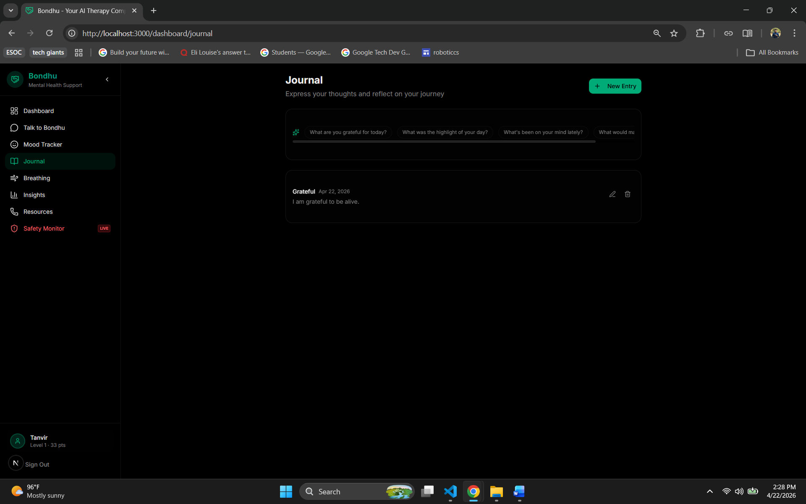
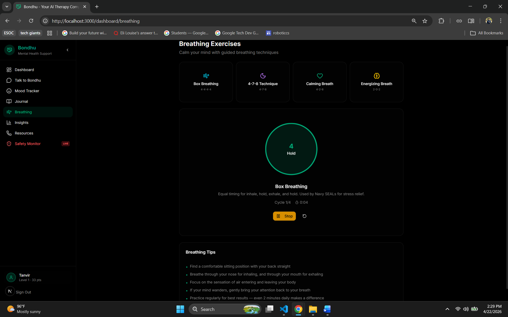
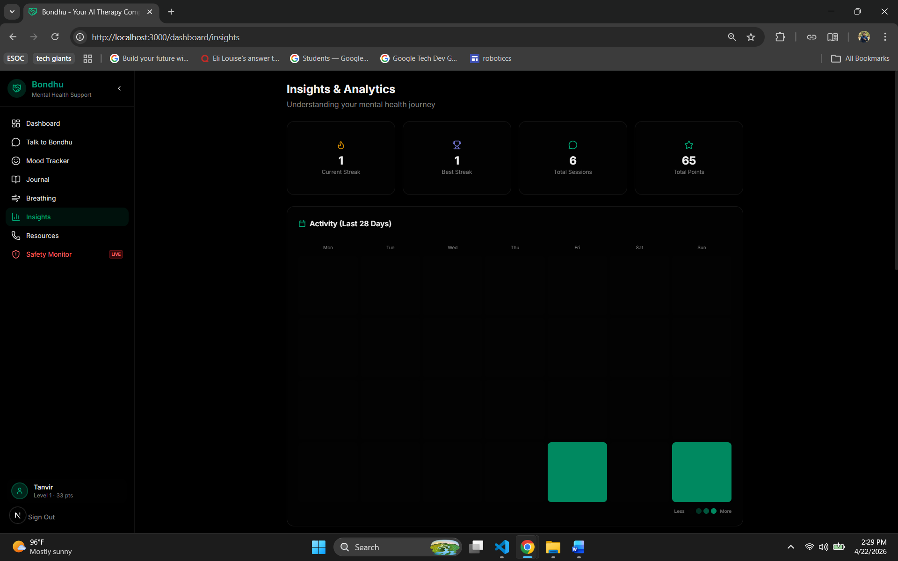
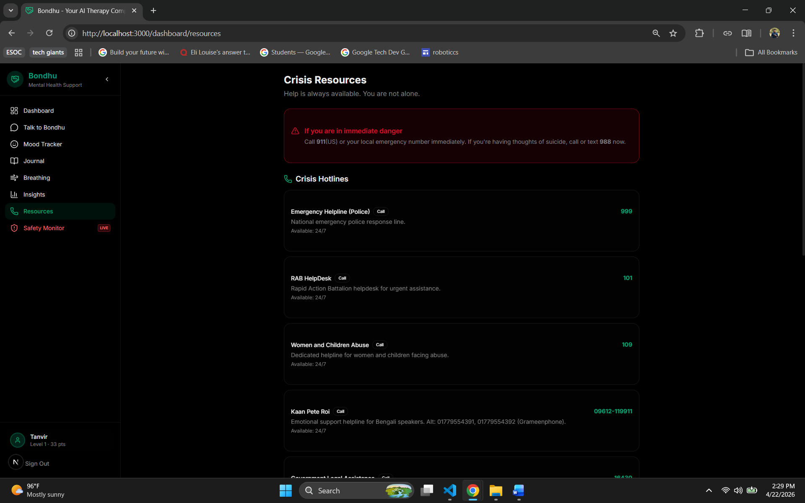

# Bondhu — IoT Based Mental Health Support System

Bondhu is an IOT based mental health support system built to help people manage their emotional wellbeing through conversation, self reflection, and real time safety monitoring. The system is designed to run on a Raspberry Pi 5 as an IoT device but works on any PC or laptop as well.

---

## Screenshots

### Talk to Bondhu


### Mood Tracker


### Journal


### Breathing Exercises


### Insights


### Crisis Resources


### Safety Monitor


---

## Features

### Talk to Bondhu
This is the main chat feature. You type how you are feeling and Bondhu replies like a compassionate therapist. It uses the Groq AI model (llama 3.3 70b) to generate warm, thoughtful responses. You can also use your voice to speak instead of typing, and Bondhu can read its replies out loud using text to speech. All your past conversations are saved and grouped by date so you can go back and read them. If you write something that sounds like a crisis or mention self harm, the system automatically sends a Telegram alert to a caregiver or guardian.

### Mood Tracker
You can log how you are feeling at any point during the day by choosing from five moods: Sad, Anxious, Neutral, Good, or Great. Each entry is saved with the date and time. The page shows your average mood score, your most common mood, and a visual trend of your recent entries so you can see how your emotional state changes over time.

### Journal
A private space to write down your thoughts. You can create new entries, edit them, or delete them. The journal gives you writing prompts to help you get started, like "What are you grateful for today?" or "What was the highlight of your day?" All entries are stored locally on the device.

### Breathing Exercises
Guided breathing exercises to help calm your mind. There are four techniques available. Box Breathing which is 4 counts in, 4 hold, 4 out, 4 hold. The 4 7 8 Technique. Calming Breath which is 4 2 6. And Energizing Breath which is 2 0 2. A animated circle shows you when to inhale, hold, and exhale. It tracks how many cycles you have completed and how long you have been breathing.

### Insights and Analytics
Shows your overall progress at a glance. You can see your current daily streak, your best ever streak, total chat sessions, and total points earned. There is also an activity grid like a GitHub contribution graph that shows which days you were active over the last 28 days.

### Crisis Resources
A page with emergency contact numbers available 24 hours a day. Includes the national police line (999), RAB HelpDesk (101), Women and Children Abuse helpline (109), Kaan Pete Roi emotional support line for Bengali speakers, and other local crisis lines. There is a prominent warning at the top telling users to call 911 or text 988 if they are in immediate danger.

### Safety Monitor (IoT Feature)
This is the IoT safety feature. When you click Start Monitoring, the app turns on the camera (webcam or Raspberry Pi camera module). It uses TensorFlow.js with the COCO SSD object detection model to scan the camera feed in real time directly in the browser, no server needed for detection. If it detects a dangerous object like a knife or scissors, it logs the event on screen and immediately sends a Telegram alert to a caregiver with the time and what was detected. Safe objects are ignored and not logged. There is a 30 second cooldown between alerts so you do not get spammed.

### Points and Levels
Every action earns you points. Starting a new session gives 5 points. Sending a message gives 2 points. Logging your mood gives 3 points. Your level goes up as you accumulate points. This encourages regular use of the app.

---

## How to Run on Another PC

You need Node.js 18 or higher and pnpm installed on your machine.

```
npm install -g pnpm
```

Create a file called `.env.local` in the project folder and add your keys:

```
GROQ_API_KEY=your_groq_api_key_here
TELEGRAM_BOT_TOKEN=your_telegram_bot_token_here
TELEGRAM_CHAT_ID=your_telegram_chat_id_here
```

Then install dependencies and start the app:

```
pnpm install
pnpm dev
```

Open http://localhost:3000 in your browser. Sign up with any email and password to get started.

---

## Running on Raspberry Pi 5

Install Node.js 18 or higher using nvm because the version from apt is outdated:

```
curl -o- https://raw.githubusercontent.com/nvm-sh/nvm/v0.39.7/install.sh | bash
nvm install 18
nvm use 18
```

Then install pnpm and follow the same steps above. To install build tools needed for the SQLite driver:

```
sudo apt install python3 make g++ libsqlite3-dev
```

To keep the app running after you close the terminal or reboot, install pm2:

```
npm install -g pm2
pnpm build
pm2 start "pnpm start" --name bondhu
pm2 save
pm2 startup
```

The Raspberry Pi camera works with the Safety Monitor feature through the browser via Chromium.

---

## Tech Stack

- Next.js 15 with TypeScript
- Groq AI (llama 3.3 70b) for the chat responses
- TensorFlow.js with COCO SSD for real time object detection in the browser
- SQLite with better sqlite3 for local data storage (no cloud database needed)
- Telegram Bot API for crisis and safety alerts
- Tailwind CSS for the dark themed UI
- Web Speech API for voice input and text to speech
